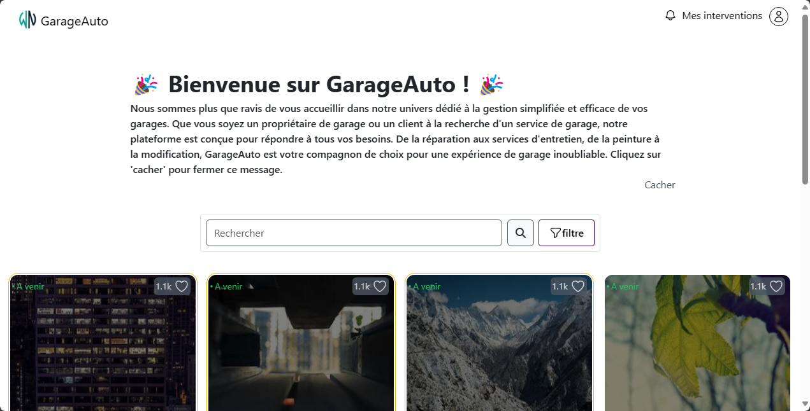
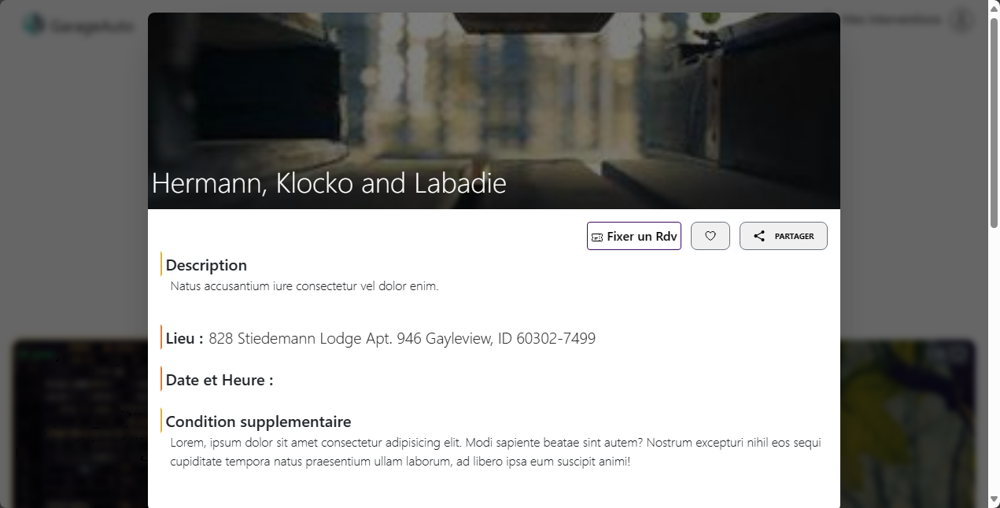
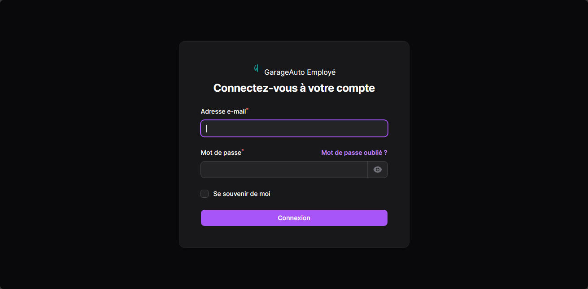
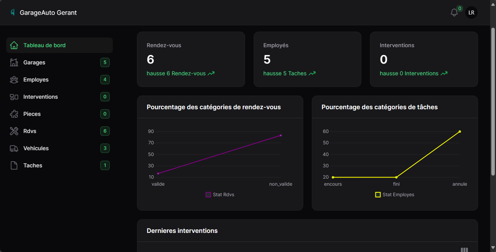
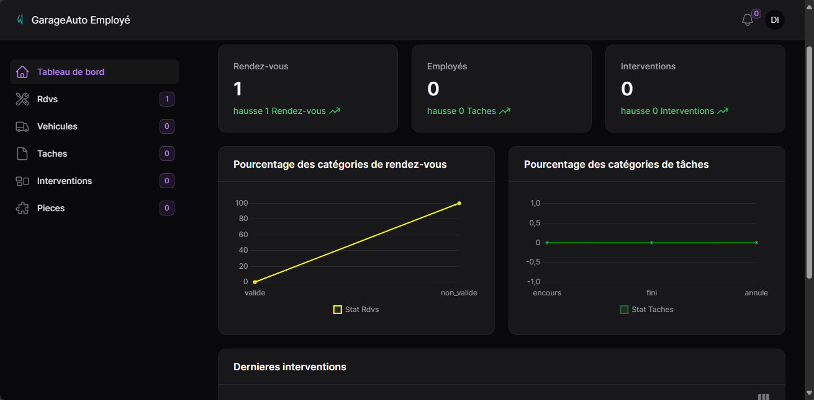
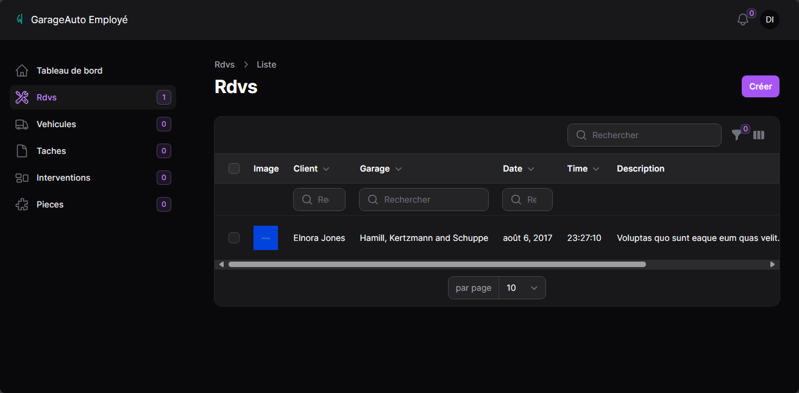
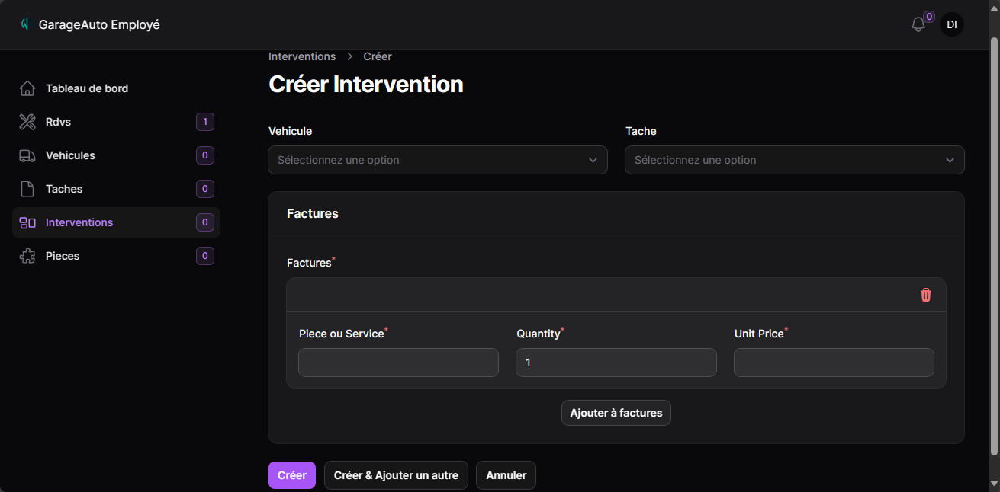

**`GARAGEAUTO`** is a garage management plateform build with passion and dedication.
I hope your visit will be rewarding and informative. Feel free to explore the code and give me feedback.

<h2>📷 Screenshots</h2>

       

 
